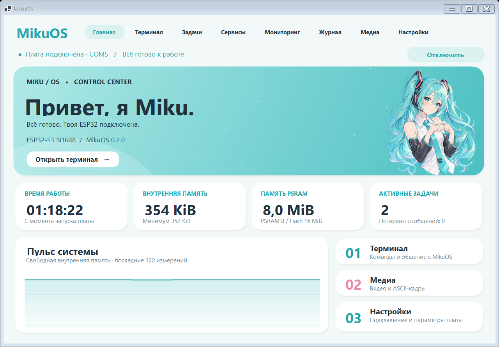

# MikuOS · Control Center 0.3 / Firmware 0.2

Учебная мини-система на **ESP32-S3-DevKitC-1 N16R8** и Windows Forms Control Center. Собственное кооперативное ядро поверх ESP-IDF/FreeRTOS, сервисы, IPC, shell и общий протокол. Simulator позволяет работать без платы.

**7 октября 2026:** MikuOS собрана с ESP-IDF 5.5.2, прошита и проверена на настоящей ESP32-S3 через COM5. Подтверждены 16 MiB Flash и 8 MiB PSRAM, команды, перезапуск и сохранение настроек. Это рабочая учебная версия; подробности и границы проверки — в [hardware-testing.md](docs/hardware-testing.md).

## Запуск

- **Подключи ESP32 к USB-UART и дважды нажми `MikuOS.lnk` в папке проекта.** Появится пиксельная Miku, приложение само найдёт плату и откроет главный экран с реальными показателями. Ярлык создаётся при публикации сборки.
- `Start-MikuOS-Device.cmd` — тот же автоматический поиск. Порт можно указать явно: `Start-MikuOS-Device.cmd COM7`.
- `Start-MikuOS.cmd` или готовый `.exe` — запуск с сохранённым режимом; при первом запуске выбран автоматический поиск. Параметр `--auto` всегда включает поиск, `--simulator` — демонстрацию.
- Готовая автономная сборка на этом компьютере: `artifacts/ControlCenter/MikuOS.ControlCenter.exe`. Её папку можно скопировать целиком на другой Windows x64; отдельная установка .NET не нужна. Эта папка исключена из Git.

В приложении доступны Dashboard, Terminal, Tasks, Services, System Monitor, Logs, Media и Settings. Для Serial используется разъём платы **USB-UART**, 115200/8N1. Нативный USB/OTG пока не подключён к протоколу MikuOS.

Светлый интерфейс: бирюзовый баннер с Miku, белые округлые карточки, розовые акценты и верхняя навигация. Заставка длится 2,6 секунды, проигрывает 8 кадров и пропускается щелчком; её можно отключить в настройках. Обе иллюстрации встроены в приложение, подключение к интернету при запуске не требуется. [Ресурсы и промпты генерации](control-center/Assets/README.md).



Если плата отсутствует, приложение остаётся в режиме ожидания и проверяет порты повторно. Автопоиск принимает устройство только после ответа на `ping` и корректного снимка MikuOS. После отключения кабеля показатели сбрасываются, а подключение восстанавливается автоматически. Демонстрация включается явно в настройках и подписана как тестовые данные. Для смены режима сначала нажми «Отключить» / «Остановить поиск», затем выбери режим в настройках и нажми «Применить».

На этой плате MikuOS уже прошита. Для новой платы первая прошивка требуется один раз; после неё повседневный запуск обходится без сборки и выбора COM-порта.

## Возможности

- Регистрация до 16 сервисов через собственный API; состояния Ready / Running / Waiting / Stopped / Faulted, период и счётчик запусков.
- Ограниченная очередь IPC, счётчик потерь, журнал из 24 записей, watchdog системного worker.
- Реальные показатели внутреннего heap: свободная память, минимум, крупнейший блок; отдельно PSRAM и размер Flash, причина перезапуска.
- Настройка интервала телеметрии 200–10000 мс с сохранением в NVS.
- Терминал с историей до 200 команд, цветами, timestamp и переключаемой автопрокруткой.
- Автоматический поиск платы, ручной выбор порта в настройках, повторное подключение после исчезновения порта или потери ответов, таймауты запросов и индикатор отсутствия данных.
- Графики последних 120 образцов, экспорт последних 3600 образцов в CSV и экспорт журнала.
- Локальное видео внутри приложения: FFmpeg → собственный WinForms canvas, 640×360 / 24 FPS; звук через LibVLC.
- ASCII Video в терминале: 96×30 / 10 FPS, монохромный, 256-цветный и true-color режимы; экспорт кадра ANSI. Пауза и остановка доступны на Media, остановка также в Terminal.
- Команда `video` переключает Media через событие устройства. Вся обработка видео выполняется на ПК.

Попробуйте в Terminal:

```text
neofetch
info
tasks
start demo
logs
stop demo
config
config telemetry_ms 500
video
```

CPU load пока передаётся как `null`: достоверный измеритель ещё не реализован. Wi-Fi, BLE, SD/TFT, OTA, файловая система и расширенные сетевые транспорты — дальнейшие модули. Раздел storage в таблице разделов зарезервирован и пока не смонтирован. У симулятора память синтетическая, конфигурация сохраняется только в пределах его объекта. Видео выводится с ограничением разрешения/FPS, ASCII воспроизводится без звука; точная синхронизация звука и видео и перемотка пока не реализованы.

## Сборка из исходников

Нужны Git, .NET 8 SDK x64 и Python 3.11; для host C++ — Visual Studio с C++/CMake либо другой C++17-компилятор.

```powershell
./scripts/setup-media.ps1
./scripts/build.ps1
./scripts/publish.ps1
./scripts/setup-esp.ps1
./scripts/build-firmware.ps1
```

`setup-esp.ps1` устанавливает закреплённый ESP-IDF 5.5.2 и инструменты для esp32s3 в `.tools`. Скрипты не меняют системный PATH постоянно. На этом компьютере .NET SDK также находится в `.tools/dotnet`. При корпоративном HTTPS-прокси можно задать PIP_CERT / SSL_CERT_FILE / REQUESTS_CA_BUNDLE с доверенным сертификатом, не отключая проверку TLS.

Прошивка после сборки:

```powershell
./scripts/flash-firmware.ps1 -Port COM5
```

Скрипт сначала сохраняет полный backup, проверяет размер 16 MiB, затем записывает bootloader, partition table и приложение. Полного стирания Flash нет. Резервные копии содержат данные устройства и исключены из Git.

## Тесты

```powershell
./scripts/build.ps1
cmake -S firmware -B firmware/build -DMIKU_HOST=ON
cmake --build firmware/build --config Release
ctest --test-dir firmware/build -C Release --output-on-failure
py -3.11 tests/host_integration.py firmware/build/Release/miku-host.exe
./.tools/python/Scripts/python.exe scripts/hardware-test.py --port COM5
./.tools/dotnet/dotnet.exe control-center/bin/Release/net8.0-windows/MikuOS.ControlCenter.dll --smoke
```

UI smoke также поддерживает `--auto`, `--serial COM5` и `--video-test C:/path/to/video.mp4`. Он проверяет заставку, выполняет команды start/stop demo и сохраняет результаты/изображения рядом со сборкой. Аппаратный тест временно меняет интервал, перезапускает плату и возвращает прежний интервал при успешном завершении. При прерывании теста проверьте `config` вручную. Тесты нельзя запускать одновременно с другим приложением, занимающим COM-порт.

GitHub Actions собирает Control Center и host, запускает .NET/C++ проверки и отдельно собирает ESP32-S3 firmware в ESP-IDF контейнере. Аппаратные проверки выполняются локально, а не в CI.

## Структура

```text
firmware/        kernel, shell, protocol, platform, ESP-IDF main
shared/          общий .NET protocol, session, simulator, ASCII conversion
control-center/  UI, Serial, Terminal, Monitoring, Media
tests/           .NET tests + C++ kernel tests
scripts/         setup, build, flash, restore, hardware checks
docs/            архитектура, протокол, аппаратные проверки
```

Документы: [архитектура](docs/architecture.md), [протокол](docs/protocol.md), [аппаратные проверки](docs/hardware-testing.md), [зависимости Media](docs/media.md).
